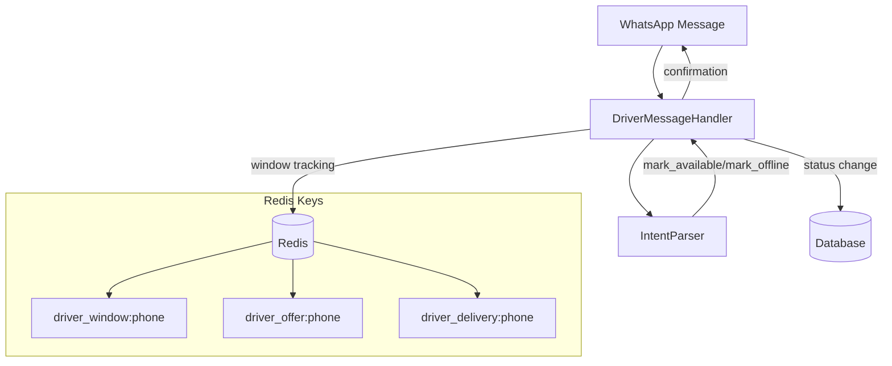

# Design Document: Driver Availability Messaging

## Overview

This feature enables drivers to proactively signal their availability via WhatsApp, leveraging the 24-hour messaging window for free-form communication. The design extends the existing intent parsing and driver handler infrastructure with minimal changes.

### Key Design Decisions

1. **Availability intents are global** - They work in any driver state and take precedence over state-specific parsing
2. **Messaging window tracking is passive** - Redis key existence indicates window status; no active management required
3. **Status transitions are guarded** - ON_DELIVERY and PENDING_ACCEPTANCE states block availability changes

## Architecture

### Component Interaction



### Data Flow

1. Driver sends message containing availability keyword
2. IntentParser detects `mark_available` or `mark_offline` intent
3. DriverMessageHandler checks current driver status
4. If valid transition, updates Driver.status in database
5. Records messaging window in Redis with 24h TTL
6. Returns appropriate confirmation/rejection message

## Components and Interfaces

### IntentParser Extensions

**New Keyword Sets:**

```python
AVAILABILITY_TRIGGERS = {
    "available", "online", "ready"
}

OFFLINE_TRIGGERS = {
    "offline", "break", "offduty"
}
```

**New Intents:**
- `mark_available` - Driver wants to signal availability
- `mark_offline` - Driver wants to go offline

**Parsing Priority:**
1. Help triggers (global)
2. Availability triggers (global, new)
3. Cancel triggers (state-dependent)
4. State-specific parsing

### DriverMessageHandler Extensions

**New Method:**

```python
async def _handle_availability(
    self, 
    driver: Driver, 
    intent: str
) -> HandlerResult:
    """
    Handle mark_available and mark_offline intents.
    
    Args:
        driver: Current driver instance
        intent: Either 'mark_available' or 'mark_offline'
    
    Returns:
        HandlerResult with confirmation or rejection message
    """
```

**Modified Method:**

```python
async def handle(self, driver: Driver, message: dict) -> HandlerResult:
    # Track messaging window first
    await self._track_messaging_window(driver.phone_number)
    
    # Check for availability intents (new)
    parsed = self.parser.parse(message, current_state=self._get_driver_state(driver))
    
    if parsed.intent in ("mark_available", "mark_offline"):
        return await self._handle_availability(driver, parsed.intent)
    
    # Existing logic for job offers and deliveries...
```

### Response Functions

**New Functions in `responses.py`:**

```python
def driver_now_available() -> TextMessage:
    """Confirmation when driver marks themselves available."""
    return TextMessage(
        body="✅ You're now marked as *available*. You'll receive job offers when orders come in."
    )

def driver_already_available() -> TextMessage:
    """When driver is already available and tries to mark available again."""
    return TextMessage(
        body="You're already marked as available. Waiting for job offers!"
    )

def driver_now_offline() -> TextMessage:
    """Confirmation when driver goes offline."""
    return TextMessage(
        body="✅ You're now *offline*. You won't receive job offers until you mark yourself available again."
    )

def driver_already_offline() -> TextMessage:
    """When driver is already offline and tries to go offline again."""
    return TextMessage(
        body="You're already offline. Send *available* when you're ready for jobs."
    )

def driver_cannot_change_status_on_delivery() -> TextMessage:
    """Rejection when driver tries to change status while on delivery."""
    return TextMessage(
        body="❌ You can't change your status while on a delivery. Complete your current job first."
    )

def driver_cannot_change_status_pending() -> TextMessage:
    """Rejection when driver tries to change status with pending job offer."""
    return TextMessage(
        body="❌ You have a pending job offer. Please accept or decline it first."
    )

def driver_help_message() -> TextMessage:
    """Updated help message for drivers."""
    return TextMessage(
        body=(
            "*Driver Commands*\\n\\n"
            "Mark yourself available:\\n"
            "• *available*\\n"
            "• *online*\\n"
            "• *ready*\\n\\n"
            "Go offline:\\n"
            "• *offline*\\n"
            "• *break*\\n\\n"
            "During delivery:\\n"
            "• Share location or type *delivered*"
        )
    )
```

## Data Models

### DriverStatus Enum (Existing)

```python
class DriverStatus(str, PyEnum):
    AVAILABLE = "available"
    ON_DELIVERY = "on_delivery"
    OFFLINE = "offline"
    PENDING_ACCEPTANCE = "pending_acceptance"
```

### Redis Keys

| Key Pattern | Purpose | TTL | Value |
|-------------|---------|-----|-------|
| `driver_window:{phone_number}` | Messaging window tracking | 24 hours | ISO timestamp |
| `driver_offer:{phone_number}` | Active job offer | 5 minutes | Offer payload |
| `driver_delivery:{phone_number}` | Active delivery | 8 hours | Delivery payload |

### Status Transition Matrix

| Current Status | mark_available | mark_offline |
|----------------|----------------|--------------|
| AVAILABLE | Already available → message | → OFFLINE |
| OFFLINE | → AVAILABLE | Already offline → message |
| ON_DELIVERY | Rejected → message | Rejected → message |
| PENDING_ACCEPTANCE | Rejected → message | Rejected → message |

## Correctness Properties

*A property is a characteristic or behavior that should hold true across all valid executions of a system—essentially, a formal statement about what the system should do. Properties serve as the bridge between human-readable specifications and machine-verifiable correctness guarantees.*

### Property 1: Availability Keyword Detection

*For any* text message containing "available", "online", or "ready" as a substring (case-insensitive), the IntentParser SHALL return `ParsedIntent(intent="mark_available")`.

**Validates: Requirements 1.1, 4.1**

### Property 2: Offline Keyword Detection

*For any* text message containing "offline", "break", or "offduty" as a substring (case-insensitive), the IntentParser SHALL return `ParsedIntent(intent="mark_offline")`.

**Validates: Requirements 2.1, 4.2**

### Property 3: Availability Intent Precedence

*For any* text message containing availability keywords and any driver state ("idle", "pending_acceptance", "on_delivery", etc.), the IntentParser SHALL return the availability intent (`mark_available` or `mark_offline`) rather than state-specific intents.

**Validates: Requirements 4.3, 4.4**

### Property 4: Status Transition Guard

*For any* driver with status ON_DELIVERY or PENDING_ACCEPTANCE, availability change requests SHALL be rejected without modifying the driver's status.

**Validates: Requirements 1.4, 1.5, 2.4, 2.5**

## Error Handling

### Invalid State Transitions

When a driver attempts to change availability from a blocked state:

1. Log the rejected attempt at INFO level
2. Return context-appropriate error message
3. Do NOT modify driver status

### Database Errors

If database update fails:

1. Log error at ERROR level
2. Return generic error message to driver
3. Do NOT update Redis window key

### Redis Errors

If Redis operations fail:

1. Log warning (non-critical for window tracking)
2. Continue with status update
3. Window tracking is best-effort

## Testing Strategy

### Unit Tests

**IntentParser Tests:**
- Test each availability keyword triggers correct intent
- Test keyword matching is case-insensitive
- Test keywords work as substrings (e.g., "I'm available" → mark_available)
- Test availability intents take precedence in all states

**Response Function Tests:**
- Test each response function returns correct message format
- Test message content matches requirements

**Handler Tests:**
- Test status transitions for each starting state
- Test rejection messages for blocked states
- Test idempotency (already available → already available message)

### Property-Based Tests

Using Hypothesis with minimum 100 iterations:

```python
from hypothesis import given, strategies as st

# Test Property 1: Availability keyword detection
@given(text=st.text())
def test_availability_keywords_detected(text):
    # Tag: Feature: driver-availability-messaging, Property 1: Availability Keyword Detection
    parser = IntentParser()
    result = parser.parse({"type": "text", "text": {"body": text}}, current_state="idle")
    
    # If text contains any availability keyword, intent should be mark_available
    text_lower = text.lower()
    for keyword in ["available", "online", "ready"]:
        if keyword in text_lower:
            assert result.intent == "mark_available"
            break

# Test Property 2: Offline keyword detection
@given(text=st.text())
def test_offline_keywords_detected(text):
    # Tag: Feature: driver-availability-messaging, Property 2: Offline Keyword Detection
    parser = IntentParser()
    result = parser.parse({"type": "text", "text": {"body": text}}, current_state="idle")
    
    text_lower = text.lower()
    for keyword in ["offline", "break", "offduty"]:
        if keyword in text_lower:
            assert result.intent == "mark_offline"
            break

# Test Property 3: Availability intent precedence
@given(
    text=st.text(),
    state=st.sampled_from(["idle", "pending_acceptance", "on_delivery", "awaiting_fuel_type"])
)
def test_availability_intent_precedence(text, state):
    # Tag: Feature: driver-availability-messaging, Property 3: Availability Intent Precedence
    parser = IntentParser()
    result = parser.parse({"type": "text", "text": {"body": text}}, current_state=state)
    
    text_lower = text.lower()
    has_availability_keyword = any(k in text_lower for k in ["available", "online", "ready"])
    has_offline_keyword = any(k in text_lower for k in ["offline", "break", "offduty"])
    
    if has_availability_keyword:
        assert result.intent == "mark_available"
    elif has_offline_keyword:
        assert result.intent == "mark_offline"
```

### Integration Tests

**Redis Messaging Window:**
- Test key creation with correct pattern `driver_window:{phone_number}`
- Test TTL is set to 86400 seconds (24 hours)
- Test key refresh on subsequent messages

**Handler Integration:**
- Test full flow: message → intent → handler → database → response
- Test concurrent availability changes
- Test database transaction rollback on error

## Implementation Notes

### Order of Changes

1. Add keyword sets to `IntentParser`
2. Add intent detection logic in `_parse_text()`
3. Add response functions to `responses.py`
4. Add `_handle_availability()` to `DriverMessageHandler`
5. Modify `DriverMessageHandler.handle()` to route availability intents
6. Add `_track_messaging_window()` helper
7. Update help message handling for drivers
8. Add tests

### Backward Compatibility

- Existing driver flow (job offers, deliveries) unchanged
- New intents are additive
- No database schema changes required